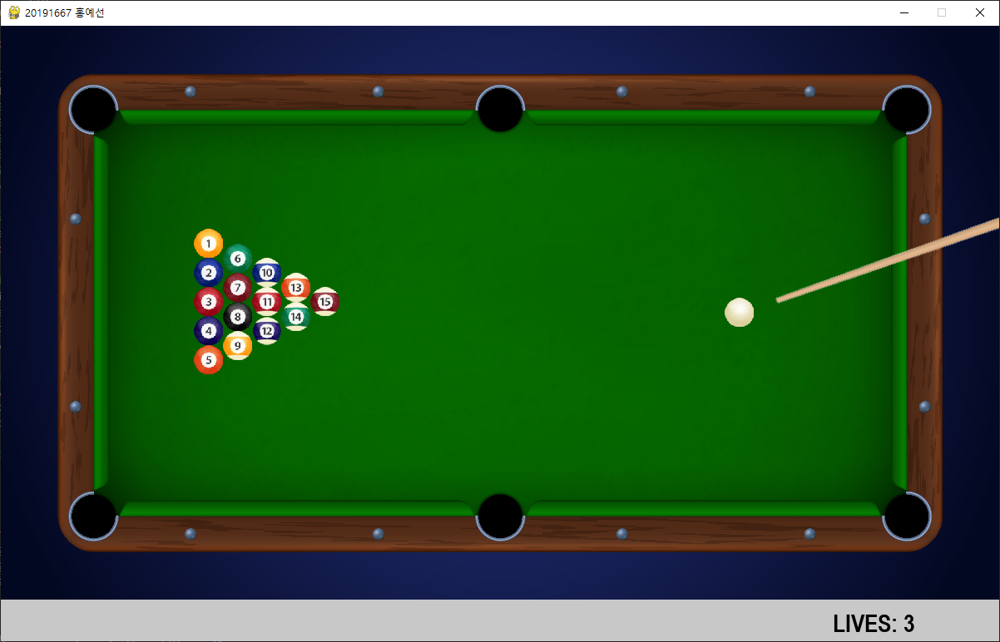

프로젝트 개요
==================
실행 방법
------------------
- final proj-src 폴더에서 8ball.py를 실행
- 창의 우측 상단 X버튼을 클릭하거나 ESC를 누르면 게임 즉시 종료
- 게임을 이기거나 지면 메세지와 함께 게임 종료

게임 규칙
------------------
- 플레이어는 흰 공만 큐 대로 칠 수 있다.
- 마우스로 큐대의 위치를 조절하고 좌클릭을 꾹 누르면 power가 올라간다.
- 원하는 power에서 좌클릭을 떼면 큐 대가 흰 당구공을 친다.
- 나머지 15개의 당구공을 흰 당구공으로 쳐서 당구대 위 6개의 포켓에 모두 넣는 것이 목표이다.
- 흰 공이 포켓에 들어가는 경우에는 목숨을 한 개 잃는다.
- 최대 목숨은 3개이고, 0이 되면 게임오버이다.
- 15개의 당구공을 모두 넣으면 플레이어의 승리이다.

	</img> 

- 공을 넣으면 아래 이미지처럼 게임화면 하단에 넣은 공이 표시된다.

	</img> 

구현 방법
================
- 당구공과 당구대, 큐 대의 물리적 상관관계를 구현하기 위해 2D 물리엔진 중 하나인 pymunk 모듈을 사용
- 가상공간 space를 정의하고 당구공과 당구대 벽을 설정하여 space에 add
- 물체를 설정할 때에는 물체의 크기, 질량, 탄력성 등을 설정
- pymunk 모듈의 impulse API를 이용하여 흰 당구공의 특정 위치에 힘을 가함
- 이후 가상공간에 배치된 당구공들과 당구대 벽들이 상호작용하며 물리법칙에 따라 움직임
